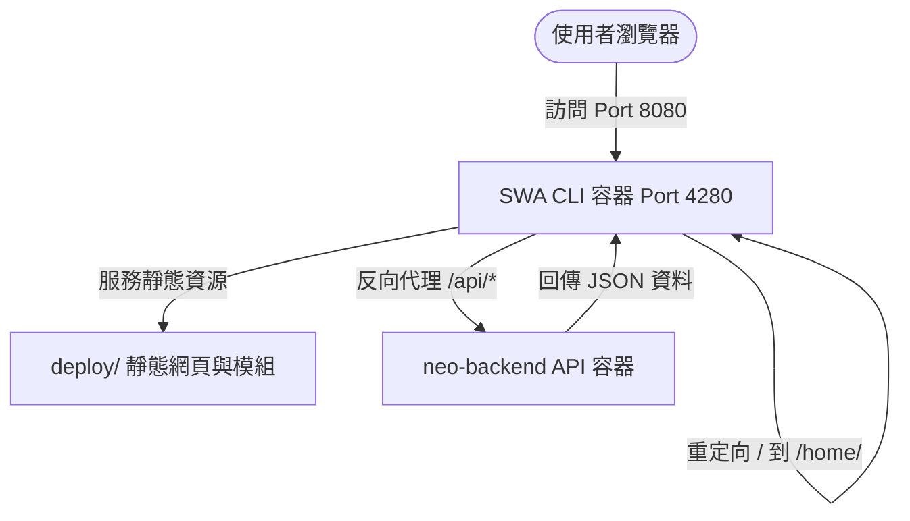

# Neo-Web 前後端分離專案說明 (Root)

Neo-Web 是採用前後端分離架構的網頁應用程式。本專案整合 **.NET 10.0 Web API** 後端與 **Vue 3 (Vite 8 + TS 6 + Tailwind 4)** 前端，並透過 **Azure Static Web Apps (SWA) CLI** 進行靜態託管與 API 反向代理。

---

## 🗺️ 專案總覽

解決方案包含以下兩個專案目錄，皆附有獨立說明文件：

* 📂 **[neo-backend/](file:///Users/ben/Projects/neo-web/neo-backend)**: ASP.NET Core 10.0 Web API 後端服務。
  👉 *開發指引：[後端開發文件 (neo-backend/README.md)](file:///Users/ben/Projects/neo-web/neo-backend/README.md)*
* 📂 **[neo-frontend/](file:///Users/ben/Projects/neo-web/neo-frontend)**: Vite 8 + Vue 3.5 + TS 6 前端獨立模組。
  👉 *開發指引：[前端開發文件 (neo-frontend/README.md)](file:///Users/ben/Projects/neo-web/neo-frontend/README.md)*

---

## 🏗️ 架構設計

本專案為前後端分離設計。前端模組編譯後輸出至 `neo-frontend/deploy`，由 SWA CLI 託管靜態檔案並轉發 `/api` 請求至後端。



---

## 🛠️ 開發與部署流程

### 💻 開發方式 (Development)

請依序啟動雙端服務：

#### 1. 啟動後端 .NET API
```bash
cd neo-backend
dotnet run
```
* 後端預設監聽 `http://localhost:5058`。已設定 CORS 允許本地連線。

#### 2. 啟動前端開發伺服器
```bash
cd neo-frontend
npm install
npm start
```
* 啟動 Vite 開發伺服器於 `http://localhost:3000`。

#### 3. 啟動 SWA CLI 本地代理測試
若需測試 SWA 靜態託管與反向代理路由：
```bash
cd neo-frontend
npm run build
cd deploy
npx swa start local-deploy
```
* 本地服務運行於 `http://localhost:4280`。SWA CLI 會將根路徑導向 `/home/`，並將 `/api/*` 轉發至後端 `http://localhost:5058`。

---

### 📦 一般部署方式 (General Deployment)

不使用容器時的傳統建置與發布步驟：

#### 1. 建置前端靜態資源
```bash
cd neo-frontend
npm install
npm run build
```
* 編譯後的靜態檔案將輸出至 `neo-frontend/deploy`。

#### 2. 發布後端 .NET API
```bash
cd neo-backend
dotnet publish -c Release -o ./publish
```
* 編譯後端為 Release 版本並輸出至 `./publish`。

#### 3. 執行與託管
將 `deploy` 中的靜態檔案置於網頁伺服器（或 Azure SWA），並執行發布的 .NET 程式，將 API 反向代理導向 .NET 服務。

---

### 🚀 容器部署方式 (Container Deployment)

使用 Docker Compose 進行建置與啟動：

#### 1. 啟動所有服務容器
```bash
docker-compose up --build -d
```
* 建置並啟動 `neo-backend` 與 `neo-frontend` 容器。
* 前端容器的 `4280` 埠對應至主機的 `8080` 埠。造訪 `http://localhost:8080` 即可瀏覽完整應用程式。

#### 2. 停止並移除容器
```bash
docker-compose down
```

---

## 🛡️ AI Agent 開發規範 (Harness)
協作 AI 助手務必遵守開發規範：
* 根目錄的 **[AGENTS.md](file:///Users/ben/Projects/neo-web/AGENTS.md)** 包含專案全域的 Agent 規則。
