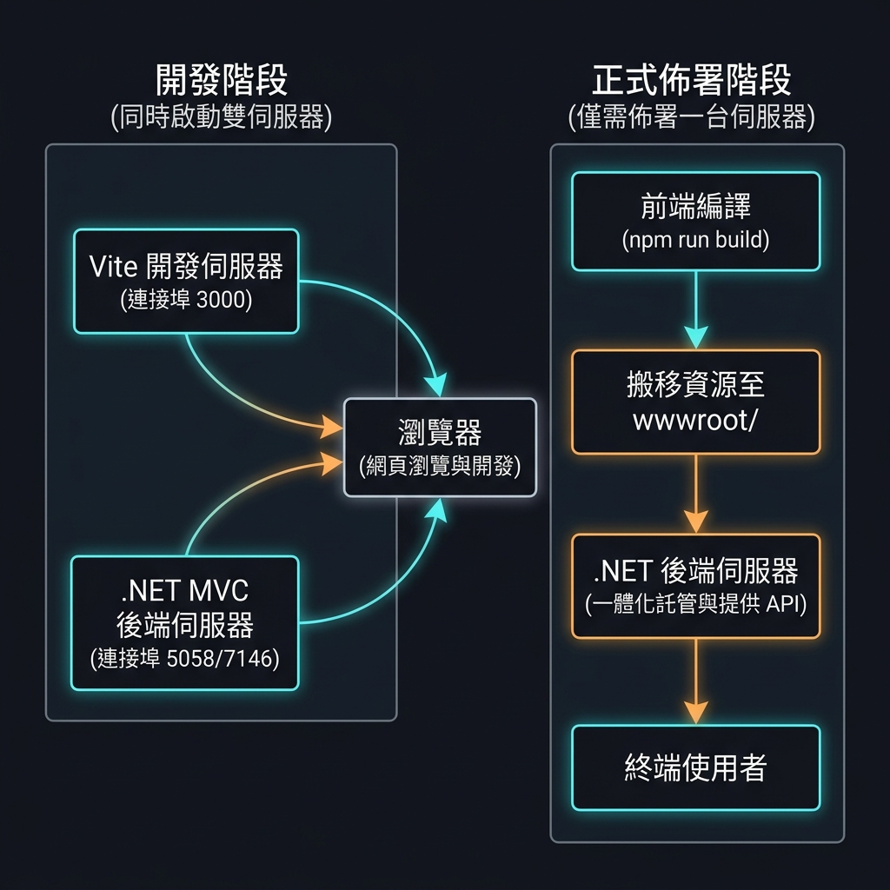

# Neo-Web 全端專案說明文件 (Root)

Neo-Web 是一個採用 **混合式 (Hybrid) 全端架構** 的網頁應用程式。專案將強大的 **.NET 10.0 MVC** 後端與現代化的 **Vue 3 (Vite 8 + TS 6 + Tailwind 4)** 前端完美結合，前端組件以「模組島嶼 (Module Islands)」的形式嵌入後端 Razor Views 網頁中。**在此架構下，.NET 後端專案同時扮演「前端靜態資源託管」與「提供後端 API 服務」的雙重關鍵角色**。

---

## 🗺️ 專案總覽地圖

本解決方案由以下兩個主要專案目錄構成，各自擁有獨立的開發說明文件：

* 📂 **[neo-backend/](file:///Users/ben/Projects/neo-web/neo-backend)**: ASP.NET Core 10.0 MVC 後端伺服器與靜態資源宿主。
  👉 *詳細開發指引請參閱：[後端開發文件 (neo-backend/README.md)](file:///Users/ben/Projects/neo-web/neo-backend/README.md)*
* 📂 **[neo-frontend/](file:///Users/ben/Projects/neo-web/neo-frontend)**: Vite 8 + Vue 3.5 + TS 6 前端模組島嶼源碼。
  👉 *詳細開發指引請參閱：[前端開發文件 (neo-frontend/README.md)](file:///Users/ben/Projects/neo-web/neo-frontend/README.md)*

---

## 🏗️ 混合式架構設計 (How it Works)

本專案採用「**開發雙端、正式單端**」的混合式架構。此設計既能享有前端極速的熱重載 (HMR) 開發體驗，又能在正式佈署時免除維護兩台伺服器的負擔。**正式佈署後，.NET 後端將同時負責前端靜態資源的託管與提供運作所需的後端 API 服務**。



### 1. 開發階段 (啟動雙伺服器)

為了維持極佳的開發體驗，開發時我們會同時開啟兩台伺服器：
* **Vite 開發伺服器 (連接埠 3000)**：提供前端 Vue 3 元件的即時轉譯與快速熱重載 (HMR)，讓任何前端修改都能在瀏覽器中秒級更新。
* **.NET MVC 後端伺服器**：負責 C# 控制器路由、提供後端 API 服務（供前端 Vue 元件調用）、資料庫存取以及伺服器端渲染 (SSR/Razor)。

### 2. 正式佈署階段 (僅需佈署一台伺服器)

為了極致簡化正式環境的佈署與運維難度，正式環境下**只會佈署並執行後端 .NET 伺服器**：
* **編譯產物搬運**：在發布前，前端執行 `npm run build` 會呼叫自動打包搬運腳本 (`scripts/build.js`)，使用 Vite 將所有模組編譯並壓縮成靜態資源檔案，並直接輸出至後端的 `neo-backend/wwwroot/` 目錄中。
* **一體化託管與 API 提供**：當執行 `dotnet publish` 發布後端時，所有編譯好的前端 JS/CSS 靜態資源都會包裝至後端的 `wwwroot` 中。正式運行時，該 .NET 伺服器會**同時負責託管靜態網頁資源，並作為 API 伺服器提供資料接口**，完全不需在正式環境運行 Node.js/Vite。

---

## 🛠️ 全端快速開發與佈署流程

### 💻 本地開發流程 (開發階段)

若要開始本地全端整合開發，請按照以下步驟啟動雙端服務：

#### 第一步：還原與安裝相依套件

* **後端**還原：

  ```bash
  cd neo-backend
  dotnet restore
  ```

* **前端**安裝：

  ```bash
  cd neo-frontend
  npm install
  ```

#### 第二步：啟動雙端服務

1. **啟動前端 Vite 伺服器** (預設運行於 `http://localhost:3000`)：

   ```bash
   cd neo-frontend
   npm start
   ```

   啟動後，您可以直接透過瀏覽器造訪各前端模組的獨立開發頁面，例如：
   * Home 模組：[http://localhost:3000/src/home/index.html](http://localhost:3000/src/home/index.html)
   * Privacy 模組：[http://localhost:3000/src/privacy/index.html](http://localhost:3000/src/privacy/index.html)

2. **啟動後端 .NET 伺服器** (通常運行於 `https://localhost:7146` 或 `http://localhost:5058`)：

   ```bash
   cd neo-backend
   dotnet run
   ```

---

### 🚀 正式佈署流程 (佈署階段 - 簡化至單伺服器)

當前端與後端皆修改完畢，準備發布至正式環境時，請依照下列步驟進行「編譯與一體化發布」：

#### 第一步：編譯前端模組並搬運至後端 wwwroot

您可以根據修改範圍，選擇編譯特定模組或所有模組。打包腳本會自動將產物產出至後端目錄：

* **情況 A：僅編譯與搬運單一特定模組**：

  ```bash
  cd neo-frontend
  npm run build <模組名稱>  # 例如: npm run build home
  ```

* **情況 B：編譯與搬運所有模組 **：

  ```bash
  cd neo-frontend
  npm run build
  ```

#### 第二步：發布 .NET 專案 (包含前端靜態資源)

前端編譯完成後，即可直接對 .NET 後端專案進行發布，打包後的資料夾將包含完整的全端程式，僅需佈署此產物即可：

```bash
cd neo-backend
dotnet publish -c Release -o ./publish
```

---

## 🛡️ AI Agent 開發防禦網 (Harness)

本解決方案內置了高規格的 AI 輔助開發規則，請協作的 AI 助手務必遵守：

* 根目錄下的 **[AGENTS.md](file:///Users/ben/Projects/neo-web/AGENTS.md)** 提供了全專案級的 Agent Rules。
* 各子目錄中亦有針對性設計的本地 Agent 規則，請務必在工作前詳讀：
  * [後端 Agent 規範 (neo-backend/AGENTS.md)](file:///Users/ben/Projects/neo-web/neo-backend/AGENTS.md)
  * [前端 Agent 規範 (neo-frontend/AGENTS.md)](file:///Users/ben/Projects/neo-web/neo-frontend/AGENTS.md)
